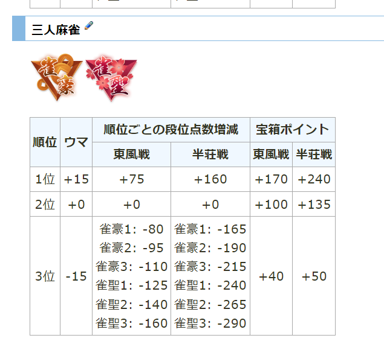

# riichicity 坂のシミュレート

rcity の 10 段坂キツすぎにゃああ！！ここに居座って 2 週間ぐらい経ったけどきつすぎてメンタルやられてしまうにゃあ…ということでシミュレーターを作ってみたにゃ

とりあえずざっとこんな感じ、それぞれの場所でスタッツを分けずに平均スタッツで見てるから実際のスタッツとは違うかもしれないにゃ


だいぶばらつきがあるから秋刀魚のランダム性がわかるにゃね…

# majsoul 版


160,0,-165,

# 天鳳坂のシミュレート

https://tenhou.net/man/
坂はここに書いてある

# n 回回して表示するやつ

```
sample.testingに実装した(名前は適当)
❯ python riichicity_emulate/sample.py
   dan   place  win  draw  lose  win_rate  draw_rate  lose_rate  init_score  rank_up_score
0   10   enton   90     0  -120    0.3506     0.3742     0.2752        3800           7600
1   10   enhan  135     0  -180    0.3500     0.3800     0.3000        3800           7600
2   10  ginton  160     0  -180    0.3636     0.3322     0.3042        3800           7600
3   10  ginhan  240     0  -270    0.3481     0.3754     0.2827        3800           7600
-----
place: enton
回した回数: 20
昇段: [False, False, False, False, False, False, False, False, False, False, False, False, False, False, False, False, False, False, False, False]
後段: [True, True, True, False, False, False, False, True, True, True, True, True, True, True, True, True, True, True, False, True]
合計昇段回数: 0
合計後段回数: 15
-----
place: enhan
回した回数: 20
昇段: [False, False, False, False, False, False, False, False, False, False, False, False, False, False, False, False, False, False, False, False]
後段: [True, True, True, True, True, True, True, True, True, True, True, True, True, True, True, True, True, True, True, True]
合計昇段回数: 0
合計後段回数: 20
-----
place: ginton
回した回数: 20
昇段: [True, True, False, True, True, True, False, True, False, True, True, True, True, False, True, True, True, True, True, True]
後段: [False, False, False, False, False, False, True, False, True, False, False, False, False, True, False, False, False, False, False, False]
合計昇段回数: 16
合計後段回数: 3
-----
place: ginhan
回した回数: 20
昇段: [False, True, True, False, True, True, True, False, False, True, True, True, False, True, False, True, True, True, True, False]
後段: [True, False, False, True, False, False, False, True, True, False, False, False, True, False, True, False, False, False, False, True]
合計昇段回数: 13
合計後段回数: 7
```
