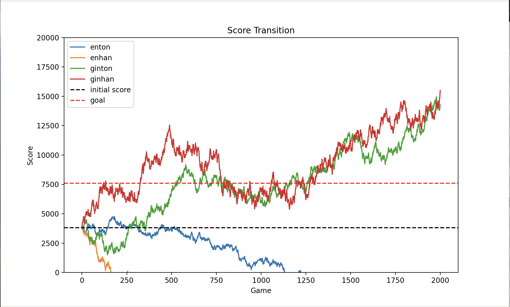
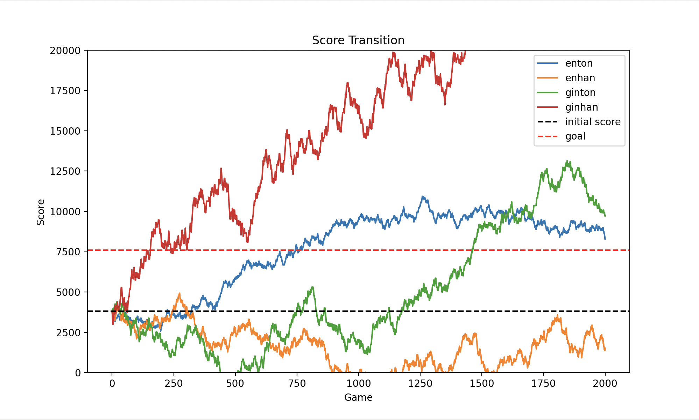

# riichicity 坂のシミュレート

rcity の 10 段坂キツすぎにゃああ！！ここに居座って 2 週間ぐらい経ったけどきつすぎてメンタルやられてしまうにゃあ…ということでシミュレーターを作ってみたにゃ

とりあえずざっとこんな感じ、それぞれの場所でスタッツを分けずに平均スタッツで見てるから実際のスタッツとは違うかもしれないにゃ

だいぶばらつきがあるから秋刀魚のランダム性がわかるにゃね…
